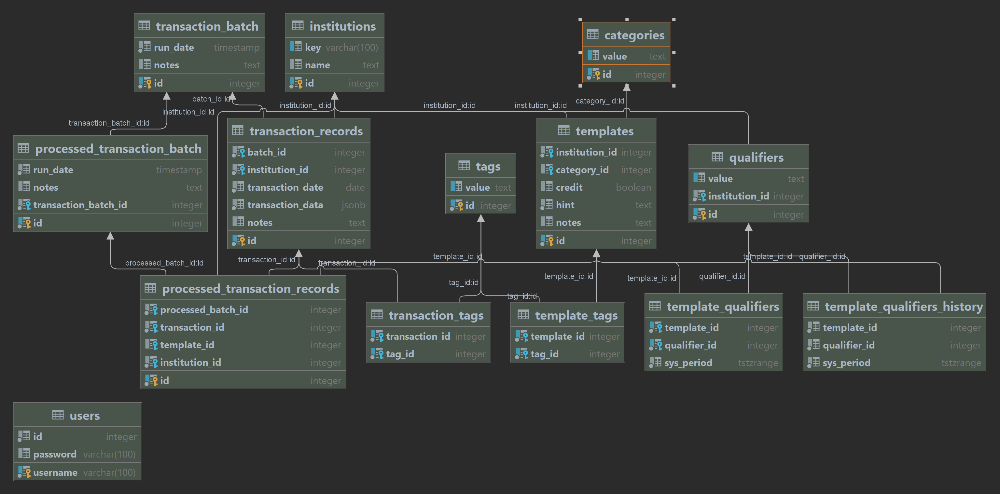

# Bank Processing

An attempt to process our bank statements / activity reports to genreate a spending breakdown
that will allow us to better understand where our money goes.

## End View - Post Processing
We want to be able to view all transactions from all accounts
and categorize them, label and tag them.

The building of the templates system provides a set of 'templates'
that convert a given transaction into something we understand.

We will store the converted transactions along with a json blob of
their original content in separate tables.

Additionally, we will be able to annotate processed results.

## Entities

Entities are institutions that we send or receive money from.

- Starbucks
- WSDOT
- Fred Meyer Fuel

An Entity contains:
- Category / Section
- Tags
- Hint

### Qualifiers
An Entity is identified by one or more qualifiers.  These are key words found in the description 
of an entry (Line Item).

Entity qualifiers are unique per bank / institution.  For instance, a entry in the Wells Fargo 
statement may read:

    "02/15/2023","-82.50","*","","PURCHASE AUTHORIZED ON 02/14 AMAZON.COM*HE6PP7J AMZN.COM/BILL WA S383046079692709 CARD 0094"

while a similar entry from Capital One would read:

    03/31/2023,04/02/2023,AMZN Mktp US*HY8040TS2,Shopping,Sale,-102.84,


## Line Items

A Line Item is an instance of an Entity in a bank statement.  It will include things like the transaction
date, the amount, etc.


-----

# Database Schema



- categories
  - Lookup table of strings
- institutions
  - List of institutions names and keys
- processed_transaction_batch
  - List of transaction sets that have been reconciled with templates
- processed_transaction_records
  - Transaction record -> Template mapping
- qualifiers
  - Lookup table of strings for specific institutions
- tags
  - Lookup table of strings
- template_qualifiers
  - Lookup table of qualifiers for specific templates
- template_qualifiers_history
  - Historical record of changes to template qualifier table
- template_tags
  - Lookup table of tags for specific templates
- templates
  - List used to match bank entries to a specific institution
  - Specifies a category for all matches
- transaction_batch
  - Id and date a set of transactions are loaded from the datafiles
- transaction_records
  - line data pulled from a datafile and matched to an institution
- transaction_tags
  - Lookup table of tags for a specific transaction
- users


______

# Run / Deployment

For Debug configurations:

This will run the app on port 8080 and will (supposedly) reload if any source code chages.

    PS C:\Users\claci\bank_processing> uvicorn app.app:app --port=8080 --host=0.0.0.0 --reload-dir app

## Setup Server

In the deploy folder you will run `setup.py`.  Check the database connection parameters in 
`common/db_access.py`.

## Connecting to Our Ubuntu Server

### Database Connection Parameters

Server IP is `10.0.0.20`

Role: `lacinaslair`

Password: `gr8ful`

Table: `lacinaslair`

### Login Parameters

Host: `clacina@devserver`

Password: `Aki4202023`

-------

# Package Configuration

Under OurSpending:

## common
Currently, only a single file 'db_access.py' which has the connection settings and some
utility functions for working with the database.

## data_processing

This program is responsible for:
- parsing the data files
- matching entries against templates
- processing batches into categories

```
python main.py

Available commands:
  load             Load activity reports for processing.
  process          Analyze a loaded batch of transactions.
  templatereport
  categoryreport   Generate a Category Breakdown Report.
```


### deploy

Here we can update / reset the database tables and content.

```
usage: setup.py [-h] [-c | --create | --no-create] [-p | --populate | --no-populate] [-e | --entities | --no-entities]

options:
  -h, --help                        show this help message and exit
  -c, --create, --no-create         Drop and Create all Tables
  -p, --populate, --no-populate     Populate Tables
  -e, --entities, --no-entities     Generate Entities
```

- The -c  option will just execute the 'init.sql' file which expectes the 
'lacinaslair' database to exist.  It will then
drop ALL tables and recreate them. 
It will then populate the 'categories', 'tags' and 'institutions' tables with the default values.

- The -p option will generate the 'qualifiers' table contents from the files in the 'datafiles' folder.

- The -e option will load the entities from the datafiles folder and create all the 'templates' used for processing data. 

## datafiles

Our activity reports from our financial institutions.

## rest_api

This is a FastAPI application serving up our REST API.

```PS C:\Users\claci\projects\OurSpending> uvicorn rest_api.app:app --port=8080 --host=0.0.0.0 --reload```

http://hab-server:8080/docs#/default/query_templates_templates_get


## spending-ui

A React/Node based service to provide our reporting / exploration user interface.


